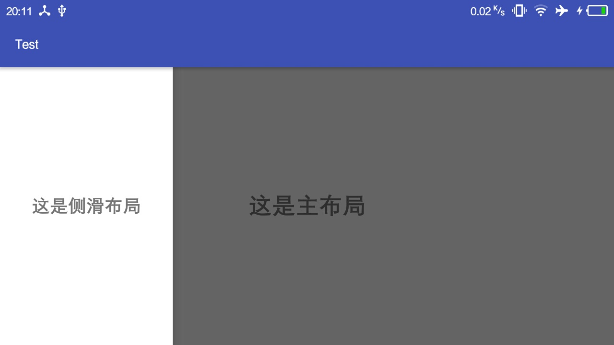
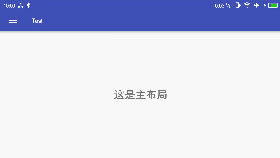

*作者：Pantiy , 转载请注明出处。*

>什么是「DrawerLayout」？ DrawerLayout 是 Google 官方提供的一个原生 Android 组件，开发者可以使用该组件实现抽屉的效果，如下图所示。



**1. 如何使用**

>让我们先来看一下 Google 官方的文档说明 ：  
*To use a DrawerLayout, position your primary content view as the first child with width and height of match_parent and no layout_gravity>. Add drawers as child views after the main content view and set the layout_gravity appropriately. Drawers commonly use match_parent for height with a fixed width.*   
<br>意思就是 :  
*使用 DrawerLayout 的时候应当只包含两个子控件，一个子控件作为主要视图展示未呼出抽屉时的界面，另一个子控件作为侧滑视图展示呼出抽屉时的界面。并且作为主视图的子控件的 layout_width 和 layout_height 属性都应设置为 match_parent，并且不包含 layout_gravity 属性；作为抽屉的子控件应当设置合适的 layout_gravity 属性（一般设置为 Start 默认抽屉在左边，也可以设置为 Right 或者 Left 指定抽屉的位置），除此之外抽屉的 layout_height 属性应当设置为 match_parent ，其 layout_width 属性一般自行设置为一个合适的值，若也设置为 match_parent 则会完全遮挡主视图，也就体现不出「抽屉」的效果。*

**2. 开干**

按以下步骤进行：

 - 创建一个名为 drawerlayout 的 xml 文件
 - 添加 DrawerLayout 控件
 - 为 DrawerLayout 控件添加两个子控件
 - 给两个子控件设置相对应的属性

下面贴出开头所展示的效果图的代码：

```
<android.support.v4.widget.DrawerLayout
    xmlns:android="http://schemas.android.com/apk/res/android"
    android:id="@+id/drawerLayout"
    android:layout_width="match_parent"
    android:layout_height="match_parent">

    <TextView
        android:layout_width="match_parent"
        android:layout_height="match_parent"
        android:gravity="center"
        android:text="@string/main_drawerLayout"
        android:textSize="26sp"/>

    <TextView
        android:layout_width="180dp"
        android:layout_height="match_parent"
        android:layout_gravity="start"
        android:background="#fff"
        android:gravity="center"
        android:text="@string/left_drawerLayout"
        android:textSize="20sp"/>

</android.support.v4.widget.DrawerLayout>

```

在这里，作为主视图的子控件一定要放在第一个，不然会出现呼出抽屉后再侧滑无法关闭的现象。

嗯，是的。就这么轻而易举的实现了。

**3. 还有什么**

抽屉效果很赞，但是奈何当今的手机屏幕越做越大，侧滑呼出这一操作有时并不友好，再者如果你的主布局是一个 ViewPager 那么在进行侧滑操作的时候很可能会误操作而切换了 ViewPager 的当前视图。所以我们应当赋予用户第二种操作方式，点击某一控件呼出抽屉。<br>

**ActionBarDrawerToggle**
> ActionBarDrawerToggle 是 Google 官方提供的一个类，它实现了 DrawerLayout.DrawerListener 接口（DrawerLayout.DrawerListener 接口定义在 DrawerLayout 类中，它能够监听 DrawerLayout 当前的状态），不仅如此 ActionBarDrawerToggle 在创建后还会将 ActionBar 的 Up Button 设置为三个横条的样式并自带动画效果，下面是效果图。



这是 ActionBarDrawerToggle 的一个构造器，也是我们将要使用到的：

```
public ActionBarDrawerToggle(Activity activity, DrawerLayout drawerLayout,
            @StringRes int openDrawerContentDescRes,
            @StringRes int closeDrawerContentDescRes) {
        this(activity, null, drawerLayout, null, openDrawerContentDescRes,
                closeDrawerContentDescRes);
    }

```

接下来放出 Activity 的代码，稍后会做说明：

```
public class MainActivity extends AppCompatActivity {

    private DrawerLayout mDrawerLayout;
    private ActionBarDrawerToggle mDrawerToggle;

    @Override
    protected void onCreate(Bundle savedInstanceState) {
        super.onCreate(savedInstanceState);
        setContentView(R.layout.activity_main);
        initViews();

        getSupportActionBar().setDisplayHomeAsUpEnabled(true);

        mDrawerToggle = new ActionBarDrawerToggle(this, mDrawerLayout,
                R.string.drawer_open, R.string.drawer_close);

        mDrawerLayout.addDrawerListener(mDrawerToggle);

        mDrawerToggle.syncState();
    }

    private void initViews() {
        mDrawerLayout = (DrawerLayout) findViewById(R.id.drawerLayout);
    }

    @Override
    public boolean onOptionsItemSelected(MenuItem item) {

        if (mDrawerLayout.isDrawerOpen(GravityCompat.START)) {
            mDrawerLayout.closeDrawer(GravityCompat.START);
        } else {
            mDrawerLayout.openDrawer(GravityCompat.START);
        }

        return super.onOptionsItemSelected(item);
    }
}

```
代码说明：

* getSupportActionBar().setDisplayHomeAsUpEnabled(); <br>
*该方法的作用是将 ActionBar 的 Up Button 显示出来（如果不显示出来让用户操作个锤子）。*

* mDrawerToggle.syncState(); <br>
*调用该方法能够将将 ActionBarDrawerToggle 的状态与所绑定的 DrawerLayout 的状态同步，这样才能根据 DrawerLayout 的状态展示不同的图标、显示相应的动画效果。该方法应该在 DrawerLayout 已经被实例化并保存后调用。*

* onOptionsItemSelected(); <br>
*该方法会在 ActionBar 上的操作按键被点击后调用，通过重写该方法实现点击 ActionBar 的操作按键开关抽屉的效果。*

**4. 最后**

本篇文章主要讲解的是 DrawerLayout 及 ActionBarDrawerToggle 的使用，二者配合使用可以快速实现清纯不做作的抽屉效果。使用并不困难，但是一些细节需要注意，如 xml 文件参数的设定、Activity 代码中相应方法的调用。

--------------------------

*欢迎关注我的个人微信订阅号「 PantiyShare 」，我会在上面不定时地分享一些原创文章，不只有技术文章呦。*
